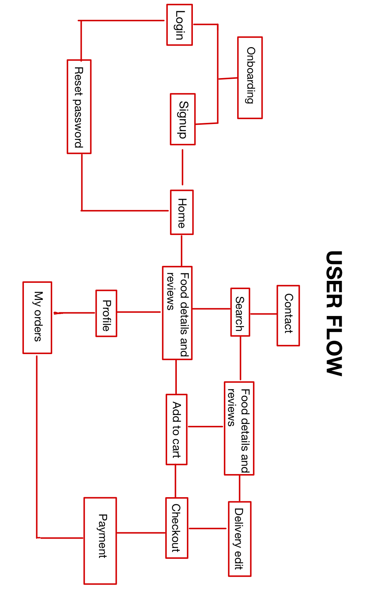
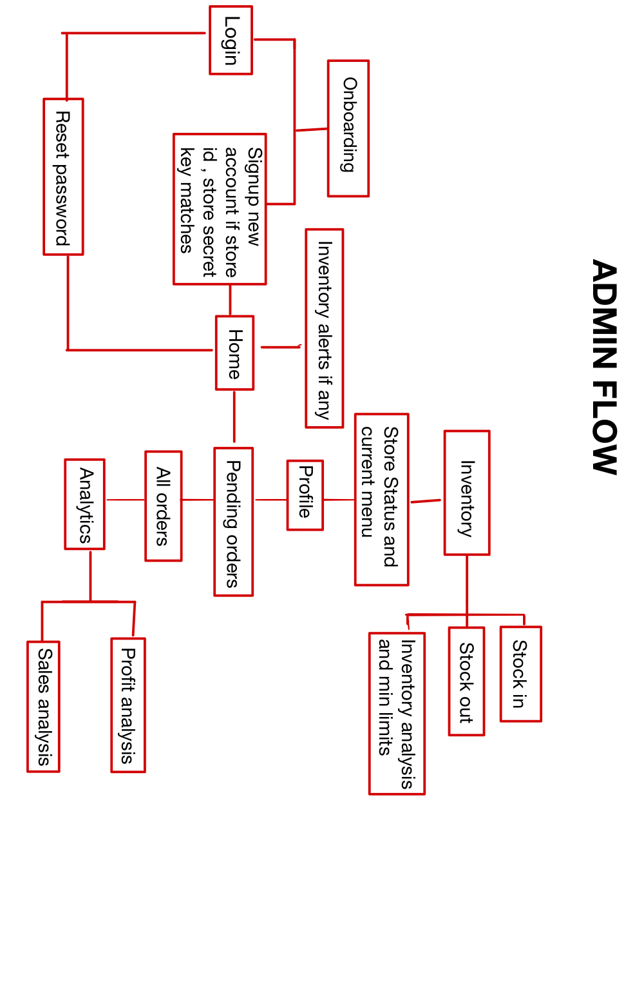

# DineEase: Comprehensive Restaurant Website and Management System

Users can browse menu, place orders with delivery or pickup functionality , contact for inquiries , leave customer reviews

Admins can manage pending orders , check complete order history , stock in inventories , get analytics regarding profit , total sales and popular menu items. They can also manage menu items. They can get an alert if inventory falls below the minimum set indicating menu updation

## TECHNOLOGY STACK:-

1)REACT

2)Tailwind CSS

3)Material UI

4)PRISMA ORM

5)MONGO DB (CAN BE LATER MIGRATED TO POSTGRESQL FOR BETTER 
NORMALISED SCHEMA)

6)TYPESCRIPT 

7)EXPRESS 

8)JWT FOR AUTHORIZATION

9)ZOD FOR RUNTIME SCHEMA VALIDATIONS

10)GITHUB FOR VERSION CONTROL

## FUTURE UPDATION:- 

Otp verification , Payment gateway integration , SOP creation for menu and automated inventory management after every order.

